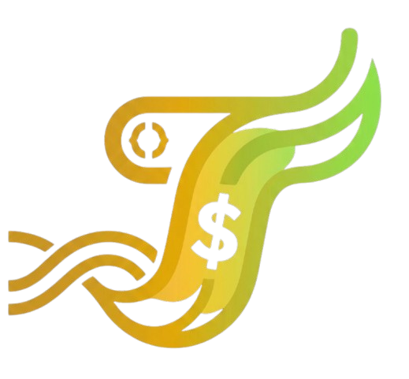
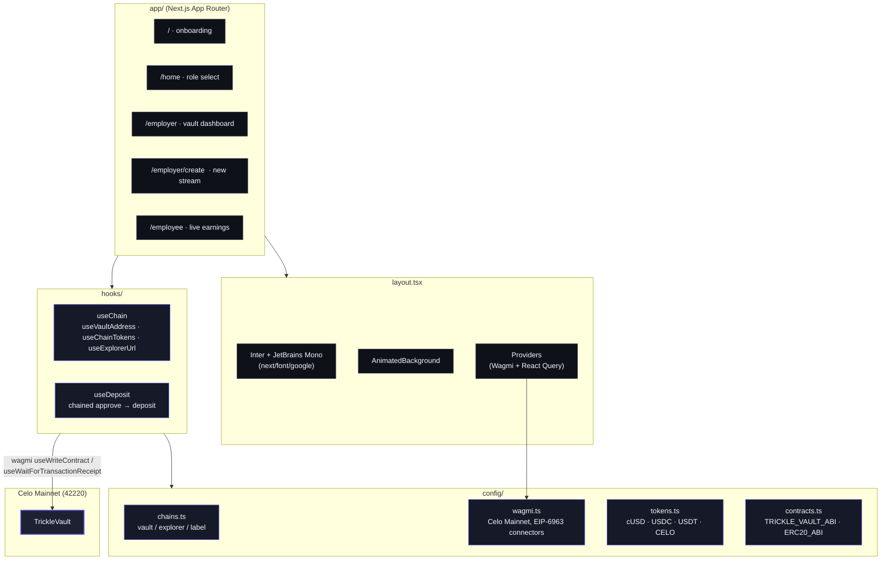
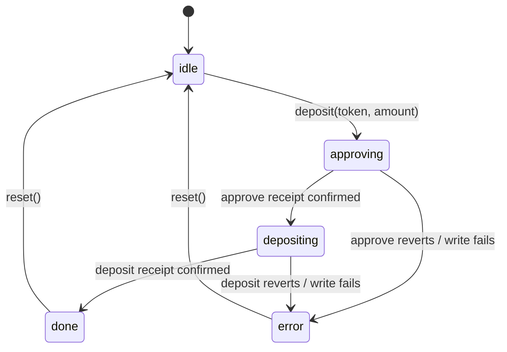

<div align="center">
  

  <h1>Trickle — MiniApp</h1>

  <p><strong>Next.js 16 frontend for the TrickleVault payroll-streaming protocol on Celo Mainnet.</strong></p>

  <p>
    
    
    
    
    
    
  </p>
</div>

> The web client for **Trickle** — a MiniApp surface that lets employers fund a vault and open per-second salary streams, and lets employees withdraw accrued earnings inside MiniPay. For protocol-level docs see the [root README](../README.md). For the Solidity side see [`../sc_trickle/README.md`](../sc_trickle/README.md).

---

## Quick start

```bash
npm install
npm run dev          # http://localhost:3000
```

The app runs on **Celo Mainnet** with 4 tokens: cUSD, USDC, USDT, CELO.

```dotenv
# .env.local (optional override)
NEXT_PUBLIC_TRICKLE_VAULT_ADDRESS=0x8a3e5d16F088A1D96f554970e5eED8468e7ddc05
```

| Script | What it does |
|---|---|
| `npm run dev` | Next.js dev server with HMR |
| `npm run build` | Production build |
| `npm run start` | Serve the production build |
| `npm run lint` | ESLint (next config) |

---

## Architecture



---

## File layout

```
fe_trickle/
├── app/                     Next.js 16 App Router
│   ├── layout.tsx           Inter + JBMono fonts, AnimatedBackground, Providers
│   ├── page.tsx             /            — onboarding / brand pill / hero CTA
│   ├── home/                /home        — role select after wallet connect
│   ├── employer/
│   │   ├── page.tsx         /employer    — vault overview, active streams
│   │   └── create/          /employer/create — new-stream form
│   └── employee/
│       └── page.tsx         /employee    — live earnings + withdraw-all
│
├── components/
│   ├── DashboardLayout.tsx  shared shell for /employer & /employee
│   ├── Navbar.tsx           top bar with wallet
│   ├── BottomNav.tsx        mobile tab bar (MiniPay form factor)
│   ├── ProfileSheet.tsx     bottom-sheet profile/disconnect
│   ├── HeroSection.tsx      onboarding hero
│   ├── StreamCard.tsx       per-stream row with live accrual
│   ├── ConnectWalletPrompt.tsx
│   ├── Toast.tsx
│   ├── Providers.tsx        WagmiProvider + QueryClientProvider
│   ├── ThemeProvider.tsx
│   └── ui/                  primitives — Button, Card, Badge, Input, Tabs,
│                            StatCard, MiniChart, AnimatedNumber, TokenIcon,
│                            FlowIllustration, animated-background, wallet-modal
│
├── config/
│   ├── chains.ts            VAULT_ADDRESS, EXPLORER_URL, CHAIN_LABEL
│   ├── wagmi.ts             createConfig — Celo Mainnet, EIP-6963 auto-discover
│   ├── tokens.ts            cUSD · USDC · USDT · CELO
│   └── contracts.ts         TRICKLE_VAULT_ABI + ERC20_ABI (forge inspect)
│
├── hooks/
│   ├── useChain.ts          vault addr, tokens, explorer, label
│   └── useDeposit.ts        approve → deposit state machine with receipt-waiting
│
├── lib/
│   └── cn.ts                clsx wrapper
│
└── public/
    ├── logo.png · favicon.png · apple-icon
    └── tokens/              token glyphs (SVG)
```

---

## Tokens (Celo Mainnet)

| Token | Address | Decimals |
|---|---|---|
| cUSD | `0x765DE816845861e75A25fCA122bb6898B8B1282a` | 18 |
| USDC | `0xcebA9300f2b948710d2653dD7B07f33A8B32118C` | 6 |
| USDT | `0x48065fbBE25f71C9282ddf5e1cD6D6A887483D5e` | 6 |
| CELO | `0x471EcE3750Da237f93B8E339c536989b8978a438` | 18 |

---

## State of the box

### Wallet discovery
`config/wagmi.ts` ships **zero** hard-coded connectors. wagmi auto-discovers any EIP-6963 wallet (MiniPay, MetaMask, Rabby, OKX, Brave, Talisman, …) and renders each with its own `name` + `icon` + `rdns`. Inside MiniPay's WebView this means the user sees one option — MiniPay — already selected.

### Deposit flow
ERC-20 approve → vault deposit is a notoriously fragile two-step. `useDeposit()` runs it as a real state machine driven by `useWaitForTransactionReceipt`, not by `setTimeout` guesses:



Returned API:
```ts
const { deposit, phase, approveTxHash, depositTxHash,
        isPending, isDone, isError, error, reset } = useDeposit();
```

### RPC
Transport uses **Forno** (`https://forno.celo.org`) as the primary RPC.

---

## Visual system

Trickle is a **dark-indigo SaaS** app, not a generic web3 dApp. The reference quality is Stripe / Linear / Ramp — restraint over decoration.

| Token | Value | Use |
|---|---|---|
| Page bg | `#0A0B14` | base canvas |
| Surface | `#161927` | cards |
| Elevated | `#1D2131` | popovers, sheets |
| Hover | `#252A3D` | interactive surface state |
| Text | `#F5F7FB` / `#B8BECE` / `#828AA0` | primary / secondary / muted |
| **Accent** | `#6366F1` (indigo-500) | single brand colour, used sparingly |
| Success | `#10B981` | the only secondary colour |
| Danger / Warn | `#EF4444` / `#F59E0B` | states only, never decoration |

Type stack: **Inter** (UI) + **JetBrains Mono** (numerics, addresses), both via `next/font/google` for zero-CLS subsetting. No external font CSS links.

Motion: 0.2–0.35s with `cubic-bezier(0.16, 1, 0.3, 1)`. Buttons get `whileHover scale 1.02`, `whileTap scale 0.98`. Ambient background = soft indigo radial blobs with `mix-blend-mode: screen` — no particles, no wireframes, no glow abuse.

---

## MiniApp surfaces

| Route | Role | Purpose |
|---|---|---|
| `/` | — | Onboarding · brand pill, hero illustration, primary CTA |
| `/home` | both | Role select (Employer / Employee) after wallet connect |
| `/employer` | payer | Vault overview · token tabs · 3-action row · active streams |
| `/employer/create` | payer | New-stream form — payee, token, monthly rate, review |
| `/employee` | payee | Live withdrawable counter · sparklines · area chart · withdraw-all |

The reference layout pattern is a 3-screen crypto-mobile flow: **onboarding → dashboard → detail**. Big tabular numerics (44–56px), uppercase eyebrow labels (12–13px tracking-[0.14em]), large breathing room.

---

## Tech stack

| | |
|---|---|
| **Framework** | Next.js 16.2 (App Router, RSC, Turbopack dev) |
| **UI** | React 19.2, Tailwind v4, framer-motion 12, lucide-react |
| **Web3** | wagmi v3.6, viem v2.47, @tanstack/react-query 5 |
| **Wallet** | EIP-6963 auto-discovery (MiniPay, MetaMask, Rabby, …) |
| **Hero asset** | Spline (`@splinetool/react-spline`) |
| **Type system** | TypeScript 5, strict mode |
| **Lint** | ESLint 9 with `eslint-config-next` |

> ⚠️ **Heads up to AI coding assistants:** see [`AGENTS.md`](./AGENTS.md). This is Next.js 16 — APIs and conventions differ from older training data. Always check `node_modules/next/dist/docs/` before writing route or layout code.

---

## Deploy

The app deploys cleanly to **Vercel** with no extra config (Next.js 16 is detected automatically). Set `NEXT_PUBLIC_TRICKLE_VAULT_ADDRESS` in the Vercel dashboard to repoint to a non-default vault.

---

## Related

| | |
|---|---|
| Root README (protocol overview) | [`../README.md`](../README.md) |
| Smart contracts (Foundry) | [`../sc_trickle/README.md`](../sc_trickle/README.md) |
| Heartbeat script | [`../scripts/README.md`](../scripts/README.md) |
| Live mainnet vault | [celoscan.io/address/0x8a3e…dc05](https://celoscan.io/address/0x8a3e5d16F088A1D96f554970e5eED8468e7ddc05) |